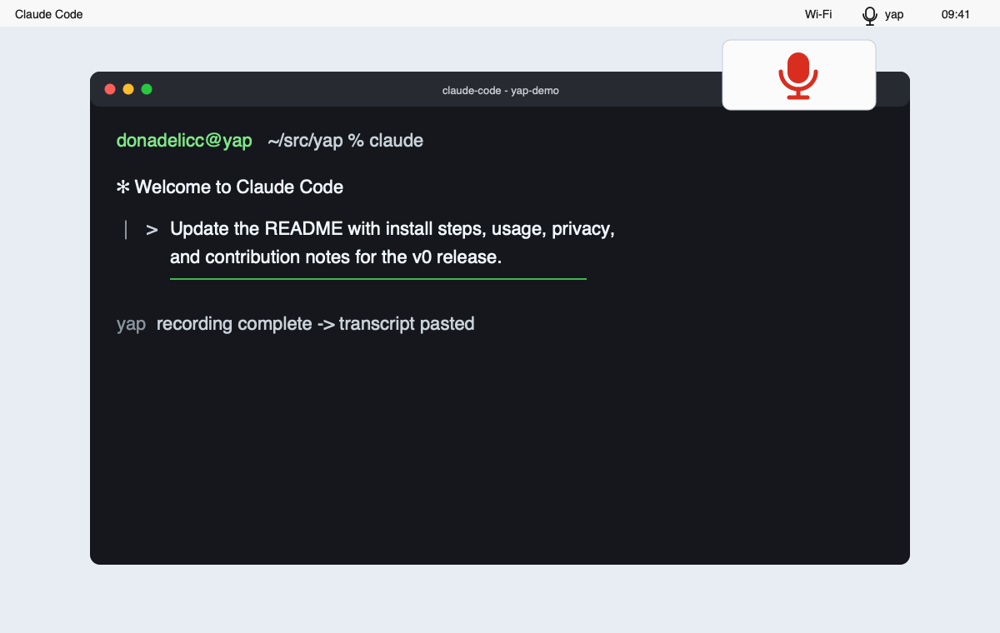

# yap

yap — local voice dictation for people who code with AI agents.

## Status

v0, pre-alpha. Expect bugs. Open issues.

## Screenshot



## What it does

- Records while you hold a global hotkey.
- Transcribes speech locally with Whisper.
- Cleans punctuation, capitalization, and filler words with a local LLM.
- Pastes the result into the currently focused app.
- Keeps the whole dictation path local.

## Privacy

100% local. Zero telemetry. Network is used only to download models from HuggingFace on first launch. No mic data, transcript, or LLM I/O ever leaves your device.

## Install

### Download from Releases

1. Download the latest `yap` build from GitHub Releases.
2. Unzip the artifact and move `yap.app` to `/Applications`.
3. Because the v0 build is unsigned, macOS will block the first normal launch. Right-click `yap.app`, choose **Open**, then choose **Open** again in the confirmation dialog.
4. Future launches can use Spotlight, Finder, or your usual app launcher.

### Build from source

```bash
git clone https://github.com/donadelicc/yap.git
cd yap
./bootstrap.sh
open yap.xcodeproj
```

In Xcode, select the `yap` target and build/run it. The project is generated from `project.yml` with XcodeGen.

## First-run

On first launch, yap walks you through the permissions needed to dictate into other apps:

1. Grant Microphone access so yap can record while the hotkey is held.
2. Grant Accessibility access so yap can paste text into the focused app.
3. Grant Input Monitoring if macOS requires it for the selected global hotkey.
4. Download the speech-to-text and cleanup models. The default models are `openai_whisper-small.en` and `mlx-community/Qwen2.5-1.5B-Instruct-4bit`.

No onboarding screenshot is checked in yet; the screenshot above shows the v0 menu bar and terminal flow.

## Usage

Hold right-option, dictate, release. Text appears in the focused app.

To change the shortcut, open yap from the menu bar, choose **Settings**, and rebind the hotkey.

## Configuration

- Hotkey: choose the push-to-talk key used for recording.
- Model selection: choose installed Whisper and LLM models, or download another available model.
- LLM cleanup toggle: turn transcript cleanup on or off. When it is off, yap pastes the raw Whisper transcript.

## Hacking on it

Start with the v0 design spec: `docs/superpowers/specs/2026-05-10-yap-v0-design.md`.

Work is organized for agent-hive. Issues labeled `agent-hive` are intended for swarm pickup, with wave labels such as `wave-6` and area labels such as `area:infra`.

## License + credits

MIT. See `LICENSE`.

Credits: WhisperKit (MIT), MLX-Swift (MIT).
